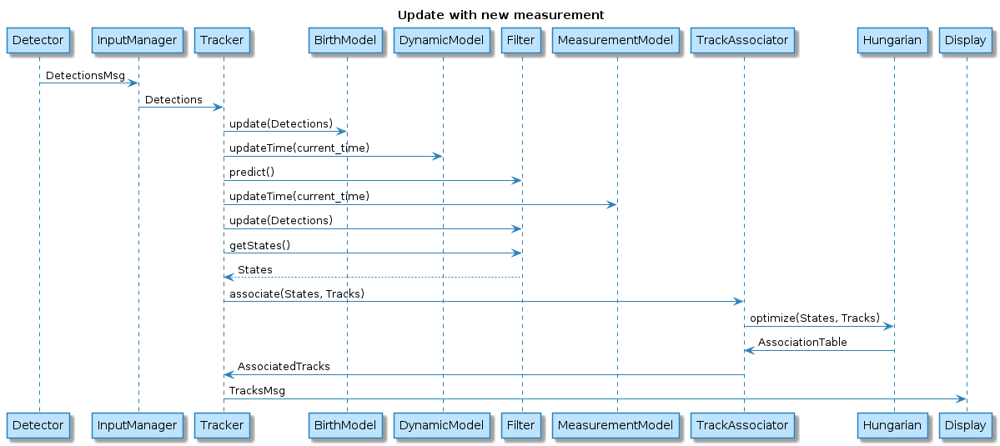

*****************
Structure & logic
*****************

The following scheme presents a global overview of the worflow. The tracker is currently based on ROS to ensure communication between the main components of the visual tracker.

The `InputManager` is responsible for handling the input stream used by the tracker. For instance, it can load a video file or connect to a webcam. The output
is an `ImageMsg` that contains a header with the timestamp of the captured imagea and the image data. 

This data enters in the `Detector` which implements the detection algorithm. Alternatively, it can load the detection from an evaluation dataset. It outputs a `DetectionsMsg`
which contain the timestamp of the captured image, the image and a list of `vision_msgs/BoundingBox2D`. 

The tracker uses those detections to update the tracks and output them as `TracksMsg` that can be used by a Display node
(e.g. RViz)

Tracker
--------

The tracking algorithm is based on `Occlusion-robust Online Multi-object Visual Tracking using a GM-PHD Filter with a CNN-based Re-identification` by N.Baisa. 
The following diagram describes the sequence to process an input detection.

Tracks association
-----------------

Track association is performed using Hungarian algorithm, more specifically its variant for rectangular cost matrices. We provide a wrapper class that uses 
`OR-tools library <https://developers.google.com/optimization/reference/algorithms/hungarian>`_ 
library to compute the assignment.

The cost used for the assignment 

Tracks dispatch
---------------

The association step returns three different outputs: assigned tracks, unassigned tracks and unassigned estimates.
